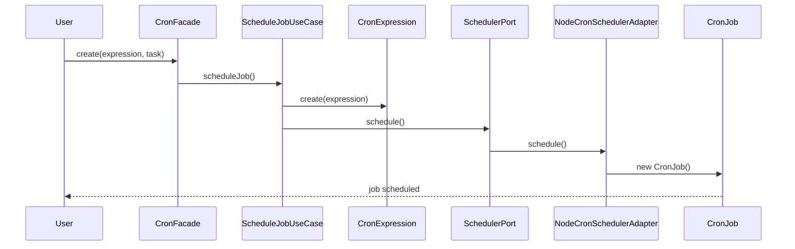

# @jmlq/cron — Architecture 🏛️

---

## 🎯 Objective

Define a cron scheduling system decoupled from external libraries using Clean Architecture.

---

## ⭐ Importance

Allows:

- replacing `cron` implementations
- supporting multiple infrastructures
- facilitating testing

---

## 🧱 Main components

### CronFacade

Main facade exposed to the user.

```ts
interface CronFacade {
  create(expression: string, task: JobHandler, options?: CronOptions);

  list();

  cancel(name: string);

  port();

  human;
}
```

---

### Factory

`createCron()`

Builds:

- `scheduler`
- `use cases`
- `facade`

---

### Scheduler Port

```ts
interface ISchedulerPort {
  schedule(expr: CronExpression, task: JobHandler);

  list();

  cancel(name: string);
}
```

---

### Adapter

`NodeCronSchedulerAdapter`

---

## Internal flow



---

## Layers

- `Application`
- `Domain`
- `Infrastructure`

---

### Domain

- `CronExpression`
- `DayName`
- `JobHandler`

---

### Application

- `CronFacade`
- `UseCases`
- `HumanCronService`
- `createCron` `factory`

---

### Infrastructure

- `NodeCronSchedulerAdapter`
- `InMemoryMutexAdapter`

---

### External library

`cron`

---

## ⬅️ Previous

- [`home`](../../README.md)

## ➡️ Next

- [Configuration](./configuration.md)
- [Express Integration](./integration-express.md)
- [Troubleshooting](./troubleshooting.md)
